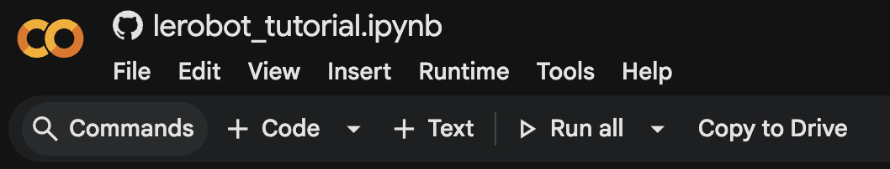

# iHR第13回　ロボット基盤モデルチュートリアル資料

## スライド資料

[第13回ロボット基盤モデルチュートリアル資料スライド(pdf)](https://drive.google.com/file/d/1zyGTDk9U01jaibdrEqyfYuZSIo4mMScM/view?usp=sharing)

## Demo
ハンズオンの前半デモとして簡単なROS2環境でのデータ収集や学習，デプロイのデモを行います．こちらは．松尾研究室で用いている公開している講義資料の一部になります．Demoの予定ですが，試したい方は以下の資料をもとに事前準備いただいて，手元で試していただけます．5.まで環境構築してご準備ください．

https://skinny-chord-c58.notion.site/5-ROS-2-2-2-2049a7a1061380fc8928e500eafc57d0

### 簡易版手順
1. docker pull (10-20分程度かかります)
```bash．
docker pull airobotbook/ros2-desktop-ai-robot-book-humble
```
2. ros2環境を起動
run.shの内容は以下の通りです．
```bash
#!/bin/bash
docker run \
-e RESOLUTION=1920x1080 \
--name pai_ros2 \
-p 15900:5900 \
-p 13389:3389 \
-p 9090:9090 \
-p 9876:9876 \ 
-p 6080:80 \
--shm-size=512m \
--privileged \
airobotbook/ros2-desktop-ai-robot-book-humble
```
```bash
chmod +x run.sh
./run.sh
```

3. VNC viewerで接続
VNC viewerで
http://localhost:6080
に接続

以降VNC viwer上のターミナルで操作

4. robot環境構築
```bash
mkdir -p ~/pai_ws/src
cd ~/pai_ws/src && git clone https://github.com/matsuolab/physicalai_teleop.git
cd ~/pai_ws && rosdep install --from-paths src --ignore-src -r -y # 依存関係解決．ビルドの前に必要なパッケージをインストール．

colcon build --symlink-install --packages-select physicalai_teleop # ビルド．--symlink-installでinstall/下へのファイルコピーの代わりにシンボリックリンク

source install/setup.bash
```

5. 学習環境を構築
```bash
cd && git clone --recursive https://github.com/matsuolab/pai_training
cd pai_training
curl -fsSL https://pixi.sh/install.sh | bash
echo 'eval "$(pixi completion --shell bash)"' >> ~/.bashrc
source ~/.bashrc
pixi install
```

6. simulator起動
```bash
cd ~/pai_ws
source install/setup.bash
ros2 launch crane_plus_gazebo crane_plus_with_table.launch.py
```

7. teleop node起動
```bash
cd ~/pai_ws
source install/setup.bash
ros2 run physicalai_teleop teleop_keyboard 
```

8. record node起動
```bash
cd ~/pai_ws
source install/setup.bash
# Start recording
ros2 bag record -a -o ~/dataset/rosbags/pekori/ep0 
# ros2 bag record -a -o ~/dataset/rosbags/pekori/ep1
```

9. 変換を実行
```bash
cd ~/pai_training
pixi run convert
```

10. 学習を実行
```bash
cd ~/pai_training
pixi run wandb login
pixi run train
# 1
# 2
# 3
``` 

11. デプロイを実行
```bash
cd ~/pai_training
pixi run infer --model-path /home/ubuntu/checkpoints/train/crane_plus_pekori_act
```


## ハンズオン
Google Colabで実行できるハンズオン

### 事前準備
以下の方法を参考にして自分のgoogle driveにcolabノートブックを保存してから実行してください。
lerobot_tutorial.ipynbを対象に以下の方法を適用してください。

[ipynbをGoogle Driveに保存して実行する方法](https://qiita.com/ongaeshi/items/7611dc6f00484d562c47)

colabを開いた後に最後必ず Drive to Copy to Drive をクリックして自分のGoogle Driveに保存してください。

画像右下のボタン



